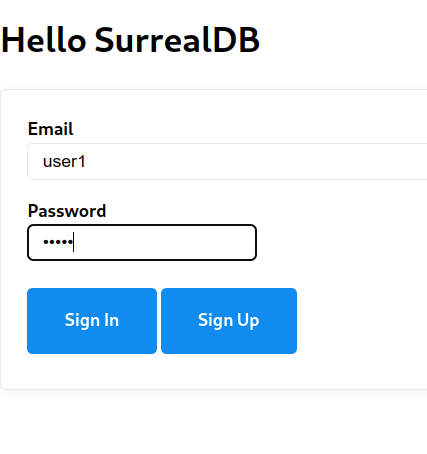
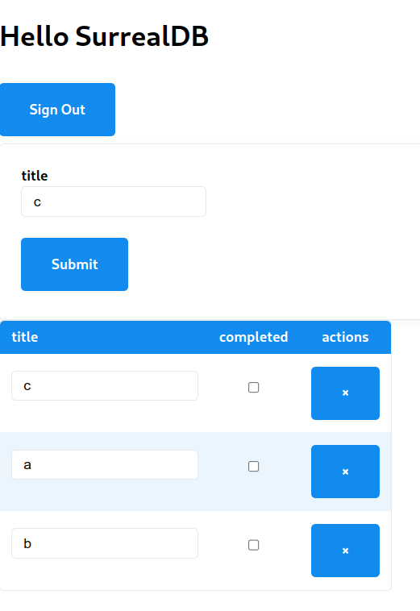

A starter-kit project from which to create your SvelteKit + SurrealDB projects

# SurrealDB + SvelteKit Demo

- Run SurrealDB in Docker `docker compose up -d`
- Run SurrealDB client ... `docker compose exec db /surreal sql -c http://localhost:8000 --db test --ns test -u root -p root` and then copy-paste the contents of `db-init/schema.sql` (there should be a better way)
- Run SvelteKit app: `pnpm install; npm run dev`
- Visit http://localhost:5173 and "Sign Up" as a new user (also signs you in)

  

- CRUD some todo's.

  

- Sign Out and Sign Up / Sign In as a different user. You should see a completely different list of todo's.
- The above separation of todo records is achived by the following line in `schema.sql` -- `DEFINE FIELD user ON todo TYPE record(user) VALUE $session.sd ASSERT $value != null;`
  See https://github.com/surrealdb/surrealdb/discussions/1298#discussioncomment-4495145

## Developing & Building

The usual SvelteKit stuff applies.
